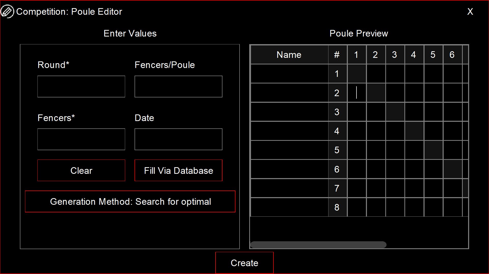

# CompetitionManager-Admin

### Új verseny létrehozása felület

---

**A szoftver a [FIE Federation](https://static.fie.org/uploads/28/141005-RIntroduction%20ang.pdf) szabálykönyvére
alapszik**

---

Kollaboráns tanulók, fejlesztők:

- Szabó Dávid

- Szürke Levente

- Szántó Dávid

---

Tartalom:

- Általános leírás

- Használati esetek

- Felületi terv

---

## CompetitionManager

A CompetitionManager egy vívó versenyek egyszerűbb lebonyolítására szolgáló asztali alkalmazás, illetve webhely. Az
asztali alkalmazás magában foglal egy admin felületet. Ez lehetőséget nyújt versenyek lebonyolítására, valamint a
versenyen résztvevő versenyzők kezelésére, ezalatt értendő a felvétel, valamint törlés, és ezen versenyzők adatainak
eltárolása és webfelületen való lekérdezésére is szolgál. Ezen felül az alkalmazásban található egy ranglista lekérdezés
is, amely szintén webfelületen keresztül történik meg.

---

## Általános leírás

A "verseny létrehozás felület" az admin panel egyik ha nem legfontosabb eleme, mivel a versenyek innen lesznek
indíthatóak. Éppen ezért ez az alkalmazásrészlet alapos, átgondolt tervezést és hibátlan kivitelezést igényel, hogy
minél inkább felhasználóbarát legyen.

Ezért a felhasználói felületet (UI) intuitívra és letisztultra terveztük (Lásd felületi terv).

---

## Használati esetek

| Azonosító                 | list_competitors                                                                                                                                                                                                                                                                                                                                                                                                                                                                                                                                                                                                                                                                 |
| ------------------------- | -------------------------------------------------------------------------------------------------------------------------------------------------------------------------------------------------------------------------------------------------------------------------------------------------------------------------------------------------------------------------------------------------------------------------------------------------------------------------------------------------------------------------------------------------------------------------------------------------------------------------------------------------------------------------------- |
| Kiváltó esemény           | A felhasználó új versenyt szeretne létrehozni                                                                                                                                                                                                                                                                                                                                                                                                                                                                                                                                                                                                                                    |
| Felhasználók              | Admin - Avagy a versenykezelő (A verseny lebonyolítását végző szervezet által választott regisztrált felhasználó)                                                                                                                                                                                                                                                                                                                                                                                                                                                                                                                                                                |
| Elsődleges lefutás        | 1. A felhasználó lenyitja a 'New' legördülő listát majd kiválasztja a 'Competition' menüpontot, vagy a felhasználó megnyomja az 'F2' billentyűt mely azonnal megnyitja a kívánt felületet. 2. Megnyílik a panel 3. Ha a felhasználó rákattint a 'Fill via database'  gombra, a panelon belül megnyílik egy másik panel mely az adatbázisban eltárolt versenyzőket listázza. 3.1 A felhasználó kiválasztja a listából a versenyen résztvevőket. 4. A verseny létrehozásra kerül.                                                                                                                                                                                  |
| Kivételek és alternatívák | 1. A szoftver nem tud csatlakozni az adatbázishoz: Ezen esetben a felhasználó már a szoftver megnyitásakor értesítést kap erről, de a verseny létrehozása panelen is értesül a problémáról és nem fog tudni versenyt létrehozni az adatbázisból. 2. Ha a megadott versenyzők száma kisebb mint 4 egy körre (Poulera) osztva: A felhasználó intuitív módon színes (piros) értesítést kap a problémáról. 3. Ha a megadott versenyzők száma nagyobb mint 8 egy körre (Poulera) osztva: A felhasználó intuitív módon színes (piros) értesítést kap a problémáról. Utóbbi kivételek a [FIE ](https://fie.org/fie/documents/rules)által megszabott szabályokon alapszanak. |
| Utófeltétel               | A rendszert futtató eszköz csatlakozik internethez A rendszer csatlakozik az adatbázishoz A megadott vívók száma eleget tesz a FIE szabályzatnak                                                                                                                                                                                                                                                                                                                                                                                                                                                                                                                         |
| Eredmény                  | Egy új verseny létrehozásra kerül: Amennyiben adatbázisból hozta létre a felhasználó a versenyt, azok automatikusan betöltődnek a körökbe Ha viszont manuális feltöltést választott, a verseny panelon üres körök (poule-ok) jelennek meg.                                                                                                                                                                                                                                                                                                                                                                                                                                   |

---

## Felületi terv

A fent látható kép egy **általánosított** terv a panel kinézetéről, mely inkább a GUI komponensek elhelyezkedését
hivatott **vizualizálni**. Ahogyan látható, maga a panel két további panelra van osztva, bal oldalon a verseny
elkészítéséhez szükséges beviteli mezők és gombok találhatóak funkció szerint csoportosítva. Jobb oldalt egy kör (poule)
felületi tervezete látható, melyet a szoftver a bevitt értékek szerint generál. Alul középen a 'Create' gomb található,
mely véglegesíti az adatokat és létrehozza a versenyt amennyiben minden adat helyes.